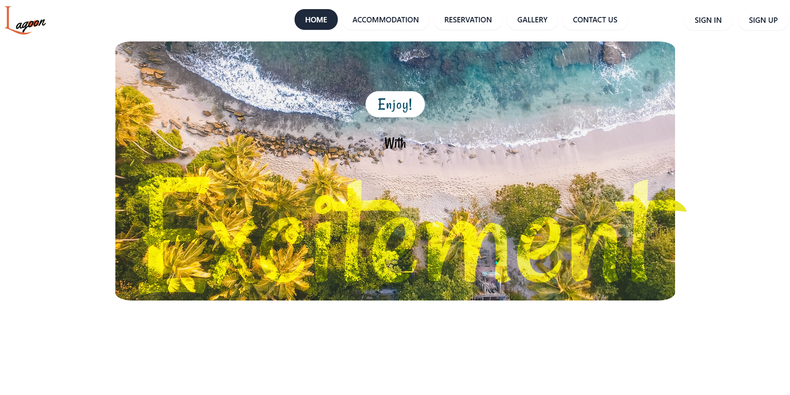

<h1>
  

  
</h1>

Hotel Frontend UI

 

Lagoon is a basic front-end project developed for a fictional hotel website. It was built to practice **HTML**, **CSS**, and **JavaScript** fundamentals and showcase UI/UX design skills.

## 🚀 Tech Stack

- HTML5  
- CSS3  
- JavaScript  

## 🎯 Purpose

The project was developed as part of a learning journey to enhance front-end development skills. Lagoon features a static website layout suitable for hotel businesses, focusing on responsive design and user-friendly navigation.

## ✨ Key Features

- Responsive homepage layout  
- Hero section with call to action  
- Services and facilities sections  
- Room previews  
- Contact form (static)  
- Smooth scrolling and basic animations  

## 📸 Screenshots

